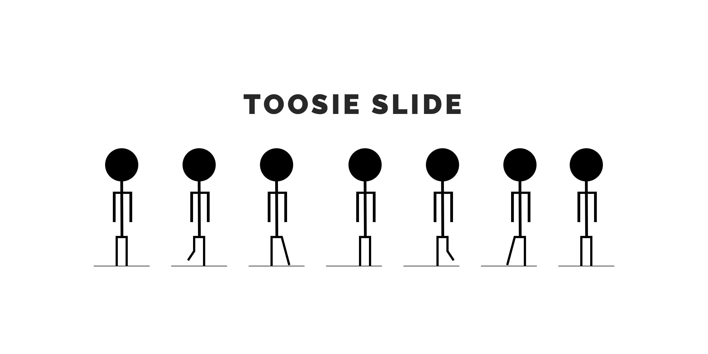

<p align="center">

</p>


[](https://twitter.com/theinkedgineer)
# ToosieSlide

`ToosieSlide` is a library that offers a custom flow layout that simulates a paginated collection view, with the cell always staying in the middle. In other words, a carousel.
In addtion `ToosieSlide` supports automatic cell resizing and alpha difference between focused and unfocused cells.

 `ToosieSlide` is fully documented [**here**](https://theinkedengineer.github.io/ToosieSlide/docs/1.1.x/index.html)
 
 Unless you have been living under a rock or born in 2030, `ToosieSlide` gets its name and its logo is inspired by `Drake`'s [**Toosie Slide**](https://www.youtube.com/watch?v=xWggTb45brM)
 
 Here is what it looks like:
 
 

## 1. Requirements and Compatibility

- iOS 10+
- XCode 11
- Swift 5.1+

## 2. Installation

### Cocoapods

Add the following line to your `Podfile`

` pod 'ToosieSlide', '~> 1.1'`

### Swift Package Manager

Add the following to you `Package.swift`

```
dependencies: [
    .package(url: "https://github.com/TheInkedEngineer/ToosieSlide.git", .upToNextMajor(from: "1.1.1"))
]
```
## 3. Code Example

### Using `UICollectionViewCarouselLayout`

```swift
lazy var collection: UICollectionView = {
  let carouselFlow = UICollectionViewCarouselLayout()
  carouselFlow.itemSize = CGSize(width: DemoCell.width, height: DemoCell.height)
  carouselFlow.minimumLineSpacing = 10
  let collection = UICollectionView(collectionViewCarouselLayout: carouselFlow)
  collection.register(DemoCell.self, forCellWithReuseIdentifier: DemoCell.identifier)
  return collection
}()
```

### Customizing `UICollectionViewCarouselLayout`

```swift
let carouselFlow = UICollectionViewCarouselLayout()
carouselfFlow.lowestVelocitySensitivity = 0.3
carouselfFlow.focusedItemScaleFactor = 1
carouselfFlow.focusedItemAlphaValue = 1
carouselfFlow.nonFocusedItemsScaleFactor = 0.5
carouselfFlow.nonFocusedItemsAlphaValue = 0.7
```


## 4. Roadmap

- support continuous swiping

## 5. Contribution

**Working on your first Pull Request?** You can learn how from this *free* series [How to Contribute to an Open Source Project on GitHub](https://egghead.io/series/how-to-contribute-to-an-open-source-project-on-github)

## Generate the project

To generate this project locally, you need [xcodegen](https://github.com/yonaskolb/XcodeGen). It is a great tool to customize a project and generate it on the go.

You can either install it manually following their steps, or just run my `setup.sh` script. It automatically installs [Homebrew](https://brew.sh) if it is missing, installs `xcodegen`, removes existing (if present) `.xcodeproj`, run `xcodegen` and moves configuratiom files to their appropriate place.

